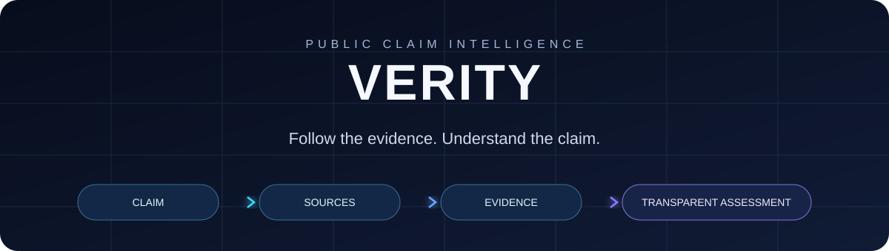
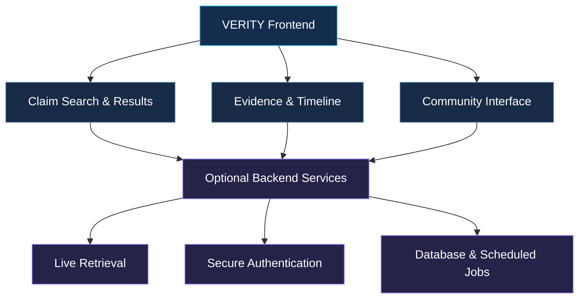

 <div align="center">



An evidence-focused platform for exploring public claims, examining sources, and understanding how assessments are presented.

[](https://devsatyamm.github.io/Verity/)
[](https://github.com/devSatyamm/Verity)
[](https://github.com/devSatyamm/Verity)

*Evidence over virality. Transparency over assumptions.*

</div>

---

## ✦ About VERITY

In a world where information spreads faster than ever, distinguishing facts from misleading claims is increasingly difficult.

**VERITY** is designed to bring claim exploration, evidence, source attribution, and claim history into one interface.

> Popularity is not proof. Every assessment should be traceable to evidence.

## ◈ How It Works

<div align="center">


</div>

| Step | Process | Description |
|---|---|---|
| 01 | **Explore** | Search and explore public claims. |
| 02 | **Collect** | Gather relevant sources and context. |
| 03 | **Analyze** | Compare evidence and assess relevance. |
| 04 | **Review** | Present findings with uncertainty and provenance. |

## ✧ Core Features

<table>
<tr>
<td width="50%" valign="top">

### 🔎 Claim Search

Explore public claims through a focused search interface.

</td>
<td width="50%" valign="top">

### 🧾 Evidence Explorer

Inspect sources, context, and supporting information.

</td>
</tr>
<tr>
<td width="50%" valign="top">

### 🧠 AI Assessment

A structured assessment interface designed to present evidence and uncertainty.

</td>
<td width="50%" valign="top">

### 🕒 Claim Timeline

Track claim revisions and changes where historical data is available.

</td>
</tr>
<tr>
<td width="50%" valign="top">

### 🗳️ Community Feedback

Keep community opinion separate from evidence-based findings.

</td>
<td width="50%" valign="top">

### 🌐 Source Integrations

Designed to accommodate public records, news sources, and online information.

</td>
</tr>
</table>

## ⌘ Architecture



VERITY's GitHub Pages edition is a static frontend. Features such as live data retrieval, secure authentication, persistent voting, AI processing, and scheduled ingestion require compatible external backend services.

## ⚡ Technology

<div align="center">


</div>

These badges represent the intended project stack. Check the current source and configuration to confirm active integrations.

## 🚀 Getting Started

### Prerequisites

- Node.js LTS
- npm
- Git

### Installation

Clone the repository:

```bash
git clone https://github.com/devSatyamm/Verity.git
cd Verity
```

Install dependencies:

```bash
npm install
```

Start the development server:

```bash
npm run dev
```

Open [http://localhost:3000](http://localhost:3000).

Check `package.json` for the scripts available in the current version.

## 🌍 Deployment

<div align="center">

### [VERITY Live Demo](https://devsatyamm.github.io/Verity/)

</div>

The static frontend can be deployed through GitHub Actions.

For repository-based GitHub Pages hosting, ensure the build correctly handles the `/Verity/` base path, asset URLs, and client-side routing.

To troubleshoot deployment:

1. Open the repository's **Settings**.
2. Navigate to **Pages**.
3. Check the configured deployment source.
4. Open the **Actions** tab.
5. Review the latest deployment workflow.

## 🛡️ Design Principles

- **Evidence over virality:** Engagement does not establish truth.
- **Transparent sourcing:** Preserve source attribution and provenance.
- **Honest uncertainty:** Allow insufficient evidence as a valid outcome.
- **Separated perspectives:** Distinguish AI assessments, community opinions, and human review.
- **Safe rendering:** Treat external content as untrusted input.
- **Privacy-conscious design:** Never expose privileged credentials in frontend code.


## 👤 Maintainers

<div align="center">

<table>
<tr>
<td align="center" width="33%">

### Satyam Mishra

<a href="https://github.com/devSatyamm">

</a>

[GitHub](https://github.com/devSatyamm) • [LinkedIn](https://www.linkedin.com/in/satyamofficial/)

</td>

<td align="center" width="33%">

### Kanak Pant

<a href="https://github.com/kanakpant0305">

</a>

[GitHub](https://github.com/kanakpant0305) • [LinkedIn](https://www.linkedin.com/in/kanak-pant-39312641b/)

</td>

<td align="center" width="33%">

### Aditya Rahul Joshi

<a href="https://github.com/aadityarahuljoshi-wq">

</a>

[GitHub](https://github.com/aadityarahuljoshi-wq) • [LinkedIn](https://www.linkedin.com/in/aditya-rahul-joshi-a51a9336b/)

</td>
</tr>
</table>

<br/>

**VERITY**  
*Make information easier to investigate.*

</div>
